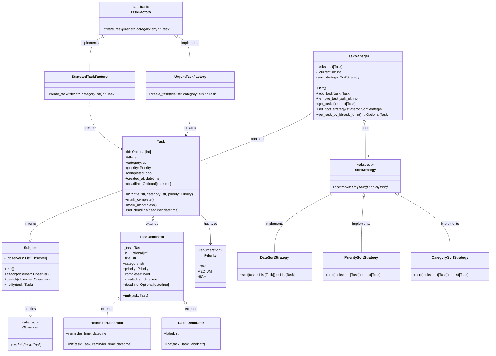

# Task Manager Application

A task management application built with Python and Streamlit.

## Setup

1. Create and activate virtual environment:
   ```bash
   python -m venv env
   # Windows
   .\env\Scripts\activate
   # Linux/Mac
   source env/bin/activate
   ```

2. Install dependencies:
   ```bash
   pip install -r requirements.txt
   ```

3. Run the application:
   ```bash
   streamlit run app.py
   ```

## Features

- Create, edit, and delete tasks
- Organize tasks by category
- Set task priorities
- Mark tasks as completed
- Add reminders and labels
- Sort tasks by date, priority, or category
- View task statistics

## Design Patterns Implemented

1. **Factory Method Pattern**
   - Creates different types of tasks (standard and urgent)
   - Encapsulates task creation logic

2. **Decorator Pattern**
   - Adds features like reminders and labels to tasks
   - Maintains single responsibility principle

3. **Observer Pattern**
   - Notifies UI components when task status changes
   - Keeps UI in sync with task state

4. **Strategy Pattern**
   - Implements different sorting strategies
   - Easily switch between sorting methods

## Usage

1. **Adding Tasks**
   - Use the sidebar to add new tasks
   - Fill in the task details (title, category, priority)
   - Optionally add reminders and labels
   - Click "Add Task" to create the task

2. **Managing Tasks**
   - Check/uncheck tasks to mark them as complete/incomplete
   - Delete tasks using the delete button
   - Sort tasks using the dropdown menu

3. **Viewing Statistics**
   - View total tasks and completion rate
   - See task distribution by category

## Requirements

- Python 3.7+
- Streamlit
- python-dateutil 


## UML Diagram

- First install the Markdown Preview Mermaid Support for VS Code
- Then make right click on the README.md file and select "Open Preview"

